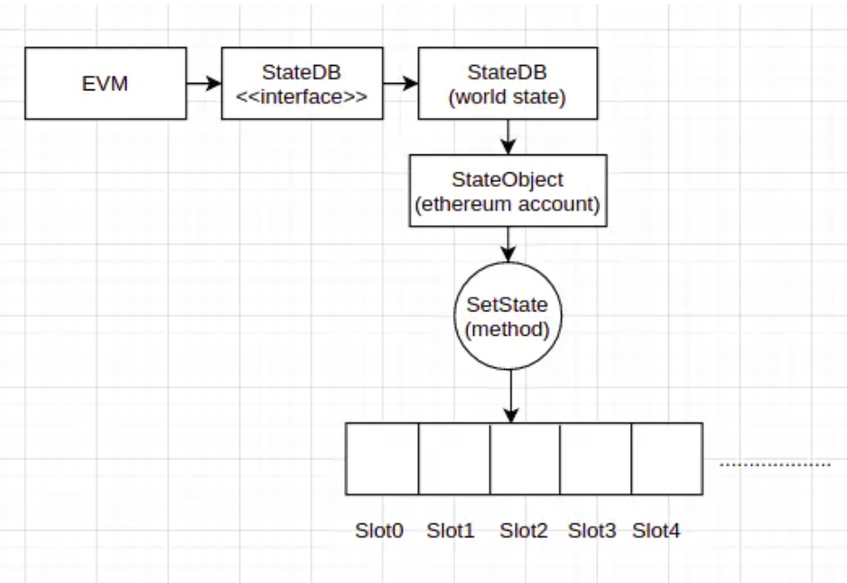

## DEEP INTO STORAGE

### 介绍
存储是公开的，但是修改是昂贵的
简单总结：
- 初始化一个slot 20000gas
- 修改一个slot  5000gas
- 删除slot中的数值 退还15000gas
- 读取方法是不需要收取gas的，但是读写方法中的读还是要收取的
### 原理
- 智能合约的存储 - 字长寻址空间
 + 键值映射，键是slot num, 值存在里面
 + 每个slot 32字节，可以存放任意数据类型
 + slot 从0开始
 + 共有2^256 - slot可用
- 内存或者calldata - 线性数据位置 可通过offset访问

布局
- 存储不能再函数调用中创建
- solc zzz.sol --storage-layout --pretty-json
- 连续的状态变量 如何可以压缩到一个slot，会自动压缩，但是不如手动压缩效率高
- 继承合约，布局也会继承，也会压缩

交互
- SLOAD
- SSTORE
  + 

指针
- 如果函数参数是storage，需要接收一个状态变量 或者 状态变量的引用
  + 可以理解为，这种是无法在外部调用的；外部不可能传递storage进来
- storage赋值到局部变量 
  + 基本类型
    - 直接复制，修改不会影响storage
  + 非基本类型
    - 如果使用storage修饰，那么就是指针引用
    - 如果使用memory修饰，那么就是克隆

访问存储
- yul
  + a.slot 
  + a.offset